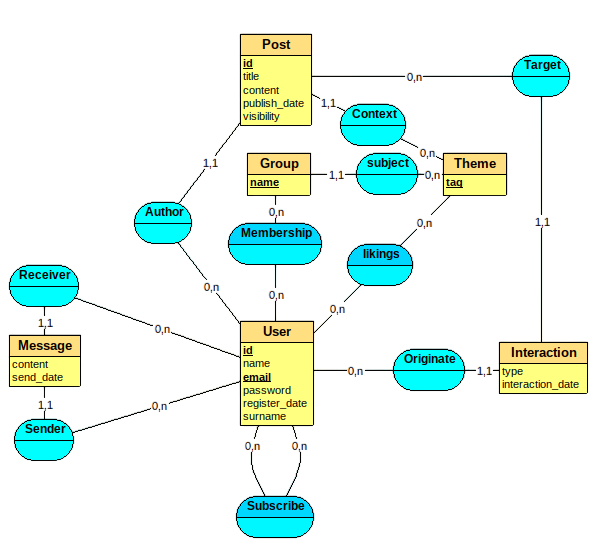

# Modèle Entités Associations

# Justification Cardinalités

- **Subscribe** : Un utilisateur peut s'abonner à plusieurs autres et plusieurs utilisateur peuvent s'abonner au même utilisateur.
  
- **Sender** : Un utilisateur peut envoyer plusieurs messages et un message n'a qu'un seul expéditeur.
  
- **Receiver** : Un utilisateur peut recevoir plusieurs messages et un message n'a qu'un seul destinataire.
  
- **Author** : Un utilisateur peut être auteur de plusieurs publications et une publication à un seul auteur.
  
- **Membership** : Un utilisateur peut être membre plusieurs groupe et un groupe peut avoir plusieurs membre.
  
- **Context** : Une publication à un contexte thématique et un thème peut être le contexte plusieurs publications.
  
- **Subject** : Un groupe est lié à un seul thème et un thème peut avoir plusieurs groupes dédiées.
  
- **Likings** : Un utilisateur peut apprécier plusieurs thème et un thème peut être apprécier par plusieurs utilisateurs.
  
- **Target** : Une publications peut être la cible de plusieurs interactions et une interaction ne cible qu'une publication.
  
- **Originate** : Un utilisateur peut être à l'origine de plusieurs interaction et une interaction n'est originaire que d'un seul utilisateur.

